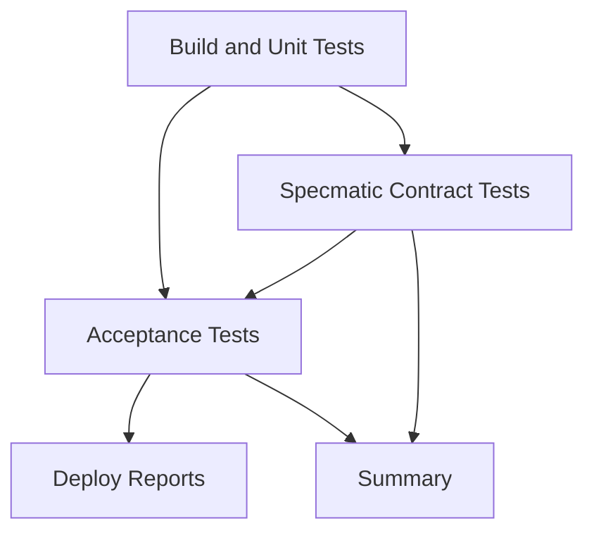

# GitHub Actions CI/CD Documentation

This repository includes a comprehensive CI/CD pipeline for the Weather API project that integrates build, unit tests, Specmatic contract testing, and Reqnroll acceptance tests.

## 🚀 Workflows Overview

### 1. Main CI/CD Pipeline (`ci.yml`)

**Triggers:** Push to `main` or `develop` branches, Pull Requests to these branches

**Jobs:**

- **Build and Unit Tests**: Compiles the solution and runs unit tests
- **Specmatic Contract Tests**: Validates OpenAPI contracts and tests stub server
- **Acceptance Tests**: Runs Reqnroll acceptance tests with HTML reporting
- **Deploy Reports**: Publishes test reports to GitHub Pages
- **Summary**: Generates workflow summary with test results

**Key Features:**

- ✅ Multi-stage pipeline with job dependencies
- ✅ Artifact sharing between jobs
- ✅ Docker-based Specmatic integration
- ✅ HTML report generation with ReportGenerator
- ✅ GitHub Pages deployment for test reports
- ✅ Comprehensive test coverage analysis

### 2. Pull Request Validation (`pr-validation.yml`)

**Triggers:** Pull Requests to `main` or `develop` branches

**Jobs:**

- **Quick Validation**: Fast build, unit tests, and basic contract validation

**Key Features:**

- ⚡ Fast feedback for pull requests
- ✅ Basic contract syntax validation
- ✅ Unit test execution
- 📊 PR summary with validation results

### 3. Nightly Comprehensive Tests (`nightly.yml`)

**Triggers:** Scheduled (2 AM UTC daily) or manual dispatch

**Jobs:**

- **Comprehensive Testing**: Extended testing suite with deep validation

**Key Features:**

- 🌙 Extended test timeout (45 minutes)
- 🔍 Deep contract validation with examples
- 🎭 Comprehensive stub server testing
- 📊 Extended coverage analysis
- 🚨 Failure notifications

## 🔧 Configuration Requirements

### Environment Variables

```yaml
DOTNET_VERSION: "8.0.x" # .NET version
JAVA_VERSION: "17" # Java version for Specmatic
```

### GitHub Secrets (if needed)

- No secrets required for current setup
- Add API keys or deployment credentials as needed

### Repository Settings

#### GitHub Pages

1. Go to Settings → Pages
2. Source: GitHub Actions
3. Reports will be available at: `https://yourusername.github.io/yourrepo/`

#### Branch Protection (Recommended)

```yaml
Protection Rules for main/develop:
  - Require status checks to pass
  - Required status checks:
      - Build and Unit Tests
      - Specmatic Contract Tests
      - Acceptance Tests
  - Require branches to be up to date
  - Require linear history (optional)
```

## 📊 Test Reports

### Available Reports

1. **Unit Test Results**: TRX format with detailed test outcomes
2. **Contract Validation**: Specmatic validation results
3. **Acceptance Test Reports**: HTML reports with step-by-step results
4. **Coverage Reports**: Generated with ReportGenerator
5. **Test Summary**: Custom HTML summary with all results

### Report Locations

- **Artifacts**: Downloaded from workflow runs
- **GitHub Pages**: Live reports at your GitHub Pages URL
- **Workflow Summary**: Available in each workflow run

## 🐳 Docker Integration

### Specmatic Container

The pipeline uses the official Specmatic Docker image (`znsio/specmatic:latest`) for:

- Contract validation
- Stub server testing
- OpenAPI specification compliance

### Container Management

- Automatic container lifecycle management
- Health checks and startup validation
- Cleanup after test completion

## 🧪 Test Structure

### Unit Tests

```
test/WeatherAPI.UnitTests/
├── Controllers/
│   └── WeatherForecastControllerTests.cs
└── Services/
    └── WeatherServiceTests.cs
```

### Contract Tests

```
test/WeatherAPI.SpecmaticTests/contract/
├── weather-api-contract.yaml
└── stubs/
    ├── weather-forecast-basic.json
    ├── weather-forecast-error.json
    └── health-check.json
```

### Acceptance Tests

```
test/WeatherAPI.AcceptanceTests/
├── Features/
│   ├── WeatherForecast.feature
│   └── SpecmaticContractTesting.feature
├── StepDefinitions/
├── Hooks/
└── Infrastructure/
```

## 🔄 Workflow Dependencies



## 🚨 Troubleshooting

### Common Issues

#### 1. Docker Permission Issues

**Solution**: Ensure Docker daemon is running and user has proper permissions

```yaml
- name: 🐋 Setup Docker
  run: |
    sudo systemctl start docker
    sudo usermod -aG docker $USER
```

#### 2. Specmatic Container Startup Failures

**Solution**: Check contract file syntax and port availability

```bash
# Validate contract locally
docker run --rm -v "$(pwd):/usr/src/app" -w /usr/src/app znsio/specmatic:latest validate weather-api-contract.yaml
```

#### 3. Test Timeout Issues

**Solution**: Increase timeout in workflow or optimize tests

```yaml
timeout-minutes: 45  # Increase as needed
--blame-hang-timeout 10m  # For dotnet test
```

#### 4. Report Generation Failures

**Solution**: Ensure ReportGenerator is installed and coverage files exist

```bash
dotnet tool install --global dotnet-reportgenerator-globaltool
```

### Debug Steps

1. Check workflow logs for specific error messages
2. Download artifacts to examine detailed results
3. Run tests locally to reproduce issues
4. Validate contract files manually with Specmatic
5. Check Docker container logs if containers fail

## 📈 Monitoring

### Key Metrics to Watch

- **Build Success Rate**: Track build failures over time
- **Test Coverage**: Monitor coverage trends
- **Test Execution Time**: Watch for performance degradation
- **Contract Compliance**: Track contract validation results

### Alerts

- **Nightly Test Failures**: Automatic notifications in workflow summary
- **Coverage Drops**: Manual monitoring recommended
- **Performance Issues**: Monitor test execution times

## 🔄 Maintenance

### Regular Tasks

1. **Update Dependencies**: Keep .NET, Java, and Docker images current
2. **Review Test Results**: Analyze nightly test reports
3. **Contract Updates**: Sync contract changes with API development
4. **Performance Tuning**: Optimize slow tests
5. **Report Cleanup**: Archive old test reports

### Version Updates

```yaml
# Update versions in workflows:
DOTNET_VERSION: '8.0.x'  # Update as needed
JAVA_VERSION: '17'       # Update as needed

# Update Docker images:
znsio/specmatic:latest   # Monitor for updates
```

## 📞 Support

For issues with:

- **CI/CD Pipeline**: Check workflow logs and GitHub Actions documentation
- **Specmatic Integration**: Refer to [Specmatic documentation](https://specmatic.in/)
- **Reqnroll Tests**: Check [Reqnroll documentation](https://reqnroll.net/)
- **ReportGenerator**: See [ReportGenerator documentation](https://github.com/danielpalme/ReportGenerator)

---

_This CI/CD setup provides comprehensive testing coverage with contract validation, ensuring API reliability and specification compliance._
