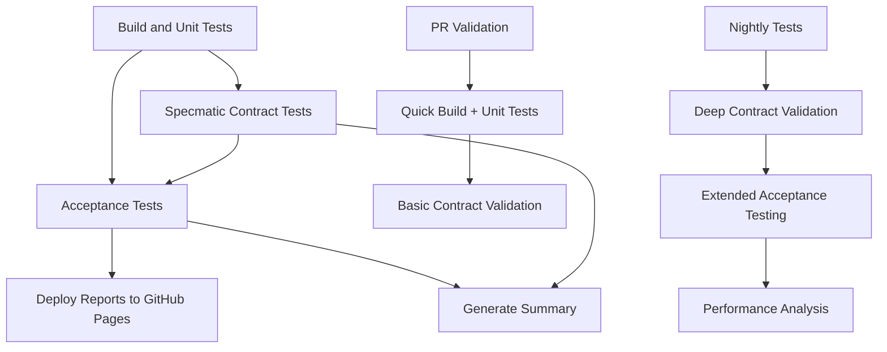

# Weather API GitHub Actions CI/CD Pipeline - Complete Setup

## 🎉 Implementation Summary

I have successfully created a comprehensive GitHub Actions CI/CD pipeline for your Weather API project that integrates:

✅ **Build and Unit Tests**
✅ **Specmatic Contract Testing**
✅ **Reqnroll Acceptance Tests**
✅ **HTML Report Generation**
✅ **GitHub Pages Deployment**

## 📁 Files Created

### GitHub Actions Workflows (`.github/workflows/`)

1. **`ci.yml`** - Main CI/CD Pipeline

   - Triggers on push to main/develop and PRs
   - Sequential jobs: Build → Contract Tests → Acceptance Tests → Deploy Reports
   - Generates comprehensive HTML reports with ReportGenerator
   - Deploys test reports to GitHub Pages

2. **`pr-validation.yml`** - Pull Request Quick Validation

   - Fast feedback for PRs (build + unit tests + basic contract validation)
   - Optimized for developer productivity

3. **`nightly.yml`** - Comprehensive Nightly Testing

   - Scheduled daily at 2 AM UTC + manual dispatch
   - Extended testing with deep contract validation
   - Performance and reliability testing
   - Failure notifications

4. **`README.md`** - Complete Documentation

   - Detailed setup instructions
   - Troubleshooting guide
   - Configuration requirements

5. **`validate-setup.sh`** - Configuration Validator
   - Validates all workflow files and project structure
   - Checks prerequisites and tool availability

### Local Development Tools

6. **`run-local-ci.sh`** (Project Root)
   - Runs the same pipeline locally before pushing
   - Complete testing workflow with report generation
   - Validates changes before CI execution

## 🔄 Pipeline Flow



## 🚀 Key Features

### Multi-Stage Testing

- **Unit Tests**: Fast feedback on core functionality
- **Contract Tests**: OpenAPI specification compliance with Specmatic
- **Acceptance Tests**: End-to-end behavioral testing with Reqnroll
- **Integration Tests**: Full system validation

### Docker Integration

- Automatic Specmatic container management
- Health checks and startup validation
- Clean container lifecycle with proper cleanup

### Comprehensive Reporting

- **TRX Reports**: Standard .NET test results
- **HTML Reports**: Rich visual test results with ReportGenerator
- **Coverage Reports**: Code coverage analysis and trends
- **Custom Summaries**: Project-specific test insights
- **GitHub Pages**: Live deployment of all reports

### Developer Experience

- **Fast PR Validation**: Quick feedback for pull requests
- **Local CI Script**: Test locally before pushing
- **Validation Tools**: Ensure proper configuration
- **Rich Documentation**: Complete setup and troubleshooting guides

## 🔧 Setup Requirements

### GitHub Repository Settings

1. **Enable GitHub Actions**

   - Go to Settings → Actions → General
   - Allow all actions and reusable workflows

2. **Configure GitHub Pages**

   - Go to Settings → Pages
   - Source: GitHub Actions
   - Reports will be available at: `https://yourusername.github.io/WeatherAPI/`

3. **Branch Protection (Recommended)**
   ```yaml
   Required status checks:
     - Build and Unit Tests
     - Specmatic Contract Tests
     - Acceptance Tests
   ```

### Prerequisites (Auto-installed in CI)

- **.NET 8.0 SDK** - Application development
- **Java 17+** - Specmatic contract testing
- **Docker** - Container management for Specmatic
- **ReportGenerator** - Enhanced HTML reporting

## 📊 Test Reports Generated

1. **Unit Test Reports**

   - Standard TRX format
   - Console output with detailed logging
   - Coverage analysis

2. **Contract Validation Reports**

   - OpenAPI specification compliance
   - Stub server validation results
   - Example generation and testing

3. **Acceptance Test Reports**

   - Reqnroll HTML reports with step-by-step execution
   - Scenario outcomes and feature coverage
   - Integration test results

4. **Comprehensive Coverage Reports**
   - Multi-format coverage analysis (HTML, Badges, JSON)
   - Trend analysis and historical comparison
   - Code quality metrics

## 🎯 Workflow Triggers

| Workflow            | Trigger                     | Purpose                      |
| ------------------- | --------------------------- | ---------------------------- |
| `ci.yml`            | Push to main/develop, PRs   | Full pipeline with reporting |
| `pr-validation.yml` | PRs only                    | Fast validation              |
| `nightly.yml`       | Scheduled 2 AM UTC + manual | Comprehensive testing        |

## 🧪 Testing Before Push

Run the local CI script to validate your changes:

```bash
./run-local-ci.sh
```

This executes the complete pipeline locally:

1. Restore dependencies
2. Build solution
3. Run unit tests
4. Validate contracts with Specmatic
5. Test stub servers
6. Run acceptance tests
7. Generate reports

## 🔍 Validation and Troubleshooting

Use the validation script to check configuration:

```bash
./.github/workflows/validate-setup.sh
```

Common issues and solutions are documented in `.github/workflows/README.md`.

## 📈 Monitoring and Maintenance

### Key Metrics to Track

- Build success rates
- Test execution times
- Coverage trends
- Contract compliance

### Regular Maintenance

- Update .NET/Java versions in workflows
- Monitor Specmatic Docker image updates
- Review and archive old test reports
- Optimize slow-running tests

## 🎉 Next Steps

1. **Commit and Push** the workflow files to your repository
2. **Enable GitHub Actions** in repository settings
3. **Configure GitHub Pages** for report deployment
4. **Set up branch protection** rules (optional but recommended)
5. **Test the pipeline** by making a small change and pushing

## 🔗 Additional Resources

- **Specmatic Documentation**: [https://specmatic.in/](https://specmatic.in/)
- **Reqnroll Documentation**: [https://reqnroll.net/](https://reqnroll.net/)
- **ReportGenerator**: [https://github.com/danielpalme/ReportGenerator](https://github.com/danielpalme/ReportGenerator)
- **GitHub Actions**: [https://docs.github.com/en/actions](https://docs.github.com/en/actions)

---

Your Weather API now has a production-ready CI/CD pipeline with comprehensive testing, contract validation, and beautiful HTML reporting! 🚀
